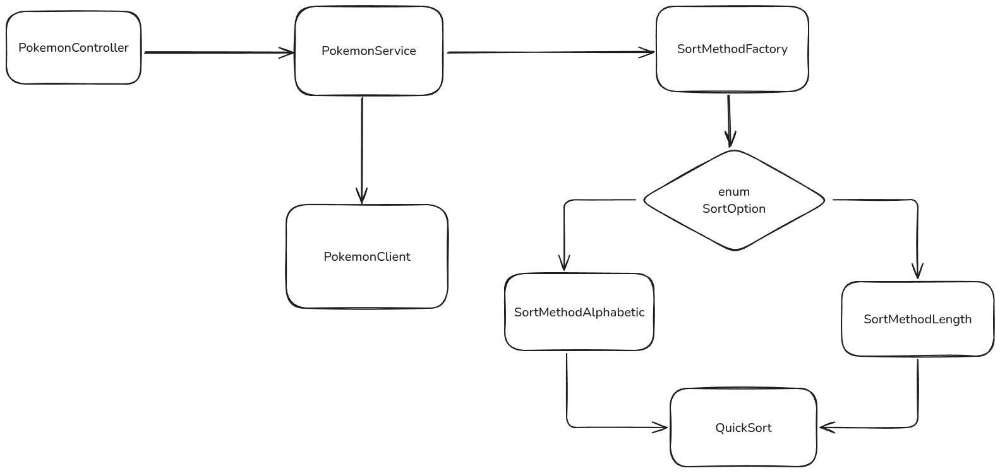

[](https://sonarcloud.io/summary/overall?id=fabianoSL1_looqbox-backend-challenge)
[](https://sonarcloud.io/summary/overall?id=fabianoSL1_looqbox-backend-challenge)

## Ordenação
Utilizei o quicksort para fazer a ordenação tanto por ordem alfabetica quando por tamanho do nome. 

No melhor dos casos, ele é O(log n) e, no pior dos casos O(n) dependendo do pivot escolhido a cada interação.

A implementação é diferente da descrita no livro *Entendendo Algoritmos*, mas a ideia é a mesma. É um algoritmo recursivo que utiliza a técnica dividir para conquistar, onde escolhemos um pivot, ordenamos os elementos menores que ele e os maiores que ele.

## Solução

**PokemonClient:** componente responsavel por realizar as chamadas http para a api.

**SortMethod:** interface que executa a ordenação de uma lista de pokemons.

**SortMethodAlphabetic e SortMethodLength:** implementações de SortMethod que utilizam QuickSort.



## Testes
- testes de integração.
- testes de pokemonController com PokemonService mockado.
- Testes unitarios PokemonService para ordenação.

## Rotas
### /Pokemons
- **query:** nome do pokemon (opcional)
- **sort:** alphabetic e length (opcioanl)

### /Pokemons/highlight
- **query:** nome do pokemon (opcional)
- **sort:** alphabetic e length (opcioanl)

exemplo de requisição `GET /pokemons?query=saur&sort=length`

## Local
porta `8080`

```bash 
docker compose up -d
```

## deploy
*A primeira requisição demora por conta do [render](https://render.com/).* 

https://poke-service-m9z6.onrender.com/pokemons

[](https://sonarcloud.io/summary/new_code?id=fabianoSL1_looqbox-backend-challenge)
